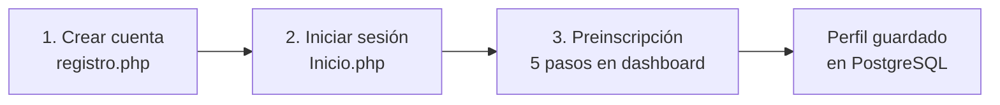
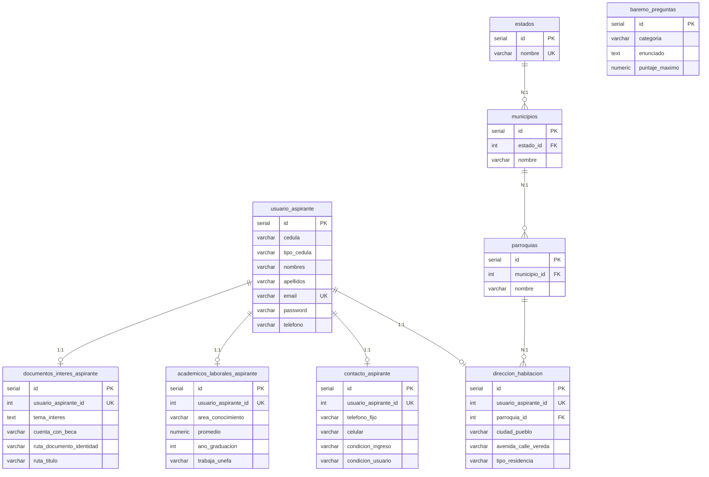
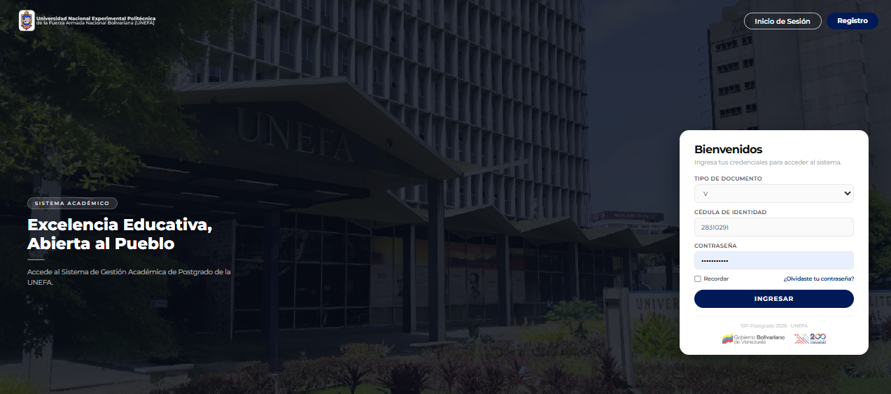
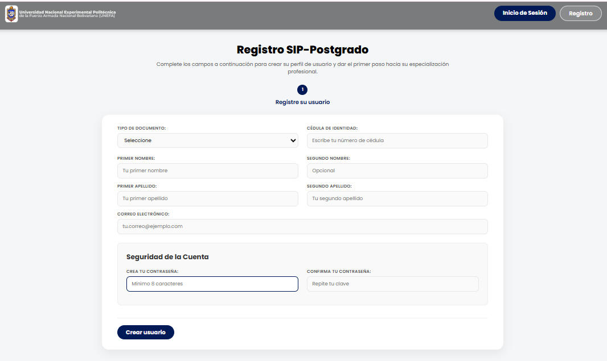
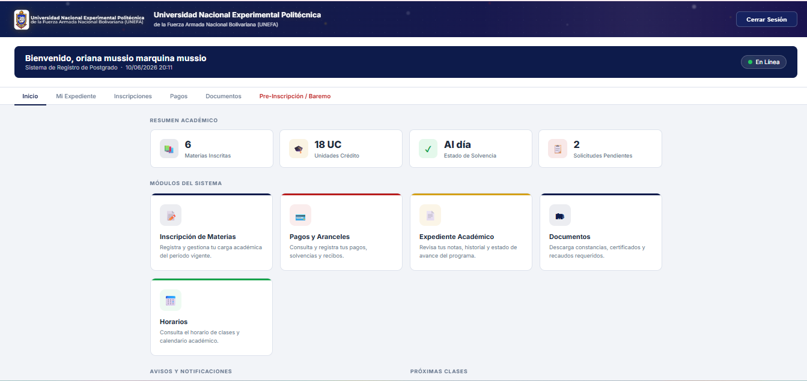
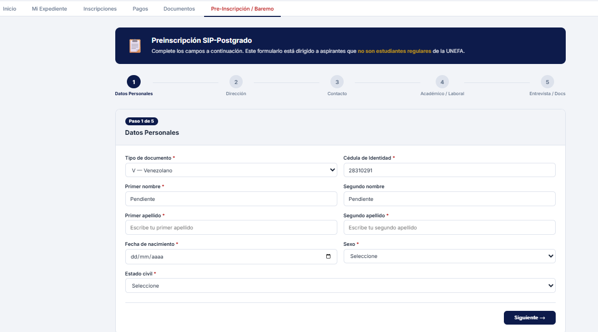
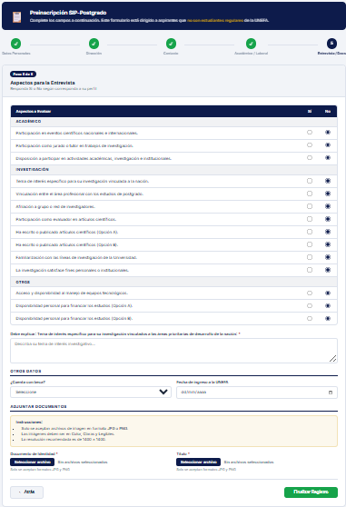
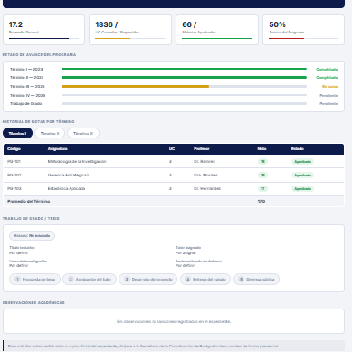
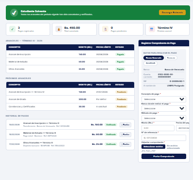

<div align="center">

# SIP-Postgrado UNEFA

### Sistema Integral de Postgrado — Portal de Registro y Preinscripción

[](https://www.php.net/)
[](https://www.postgresql.org/)
[](https://laragon.org/)
[](./documentacion/MANUAL_ENTREGA_SIP_POSTGRADO.md)

**Universidad Nacional Experimental Politécnica de la Fuerza Armada Nacional Bolivariana**

*Excelencia Educativa, Abierta al Pueblo*

---

[Descripción](#-descripción) ·
[Características](#-características) ·
[Tecnologías](#-tecnologías) ·
[Arquitectura](#-arquitectura) ·
[Instalación](#-instalación-local-laragon--apache) ·
[Base de datos](#-base-de-datos) ·
[Capturas](#-capturas-de-pantalla) ·
[Documentación](#-documentación)

</div>

---

## 📋 Descripción

**SIP-Postgrado** es la plataforma web institucional de la **UNEFA** orientada a la gestión académica de programas de **maestría y especialización**. En su fase actual, el sistema implementa el **módulo de registro relacional del aspirante**, permitiendo que personas interesadas en ingresar a un programa de postgrado:

- Crear una **cuenta de acceso** con credenciales verificadas (cédula, correo y contraseña cifrada con bcrypt).
- **Iniciar sesión** de forma segura mediante sesiones PHP regeneradas.
- Completar la **preinscripción** a través de un formulario multipaso de **5 etapas** (carrusel/stepper).
- Persistir su información de manera **normalizada** en PostgreSQL, distribuida en tablas relacionales especializadas.

El portal está diseñado bajo una **arquitectura MVC ligera por capas**, con separación clara entre vistas, controladores y acceso a datos. Esto habilita consultas, reportes institucionales e integración con módulos futuros: baremo completo, inscripciones, pagos y expediente académico.

| Módulo | Estado |
|--------|--------|
| Registro de aspirante | ✅ Operativo |
| Autenticación con sesión segura | ✅ Operativo |
| Preinscripción (carrusel 5 pasos) | ✅ Operativo |
| Persistencia relacional con transacciones PDO | ✅ Operativo |
| Carga de documentos (CI + título) | ✅ Operativo |
| Baremo dinámico (lectura) | ✅ Operativo |
| Guardado de respuestas baremo | ⏳ Próxima iteración |
| Inscripciones / Pagos | ⏳ Esqueleto visual |

---

## ✨ Características

### Para el aspirante

- **Registro público** con validación cliente (AJAX) y servidor.
- **Login** por tipo de documento, cédula y contraseña.
- **Dashboard autenticado** con navegación por pestañas.
- **Formulario multipaso** con validación dual (JavaScript + PHP):
  1. Datos personales
  2. Dirección de habitación
  3. Contacto y redes sociales
  4. Trayectoria académica y laboral
  5. Baremo, tema de investigación y documentos adjuntos
- **Actualización idempotente** del perfil (UPSERT) sin duplicar registros.

### Para el equipo técnico

- Consultas parametrizadas con **PDO** (protección contra inyección SQL).
- **Transacciones atómicas** (`beginTransaction` / `commit` / `rollBack`).
- Rutas dinámicas compatibles con subcarpetas de Laragon (`app_url()`).
- Esquema relacional documentado y script SQL de inicialización incluido.

---

## 🛠 Tecnologías

| Categoría | Tecnología | Uso |
|-----------|------------|-----|
| **Backend** | PHP 5.6+ (desarrollo: 8.x en Laragon) | Lógica de negocio, sesiones, controladores |
| **Base de datos** | PostgreSQL 12+ | Persistencia relacional (`postgrado`) |
| **Acceso a datos** | PDO + `pdo_pgsql` | Consultas preparadas nativas |
| **Servidor web** | Apache (Laragon) | Hosting local y despliegue |
| **Frontend** | HTML5, CSS3, JavaScript (vanilla) | UI responsive, carrusel multipaso |
| **Tipografía** | Google Fonts (Inter, Montserrat, Poppins) | Identidad visual institucional |
| **Seguridad** | `password_hash` / `password_verify`, `session_regenerate_id` | Autenticación y sesiones |

### Extensiones PHP requeridas

- `pdo_pgsql` — **obligatoria**
- `mbstring` — recomendada (cadenas UTF-8)

---

## 🏗 Arquitectura

El proyecto sigue una **arquitectura en capas** con puntos de entrada públicos en la raíz y lógica reutilizable en `includes/` y `queries/`.

```
┌─────────────────────────────────────────────────────────────────┐
│                    PUNTOS DE ENTRADA (Raíz)                     │
├─────────────────┬─────────────────────┬─────────────────────────┤
│   Inicio.php    │    registro.php     │       index.php         │
│   (login UI)    │ (registro + AJAX)   │  (dashboard autenticado)│
└────────┬────────┴──────────┬──────────┴────────────┬──────────────┘
         │                   │                       │
         ▼                   ▼                       ▼
┌────────────────┐  ┌───────────────────┐  ┌─────────────────────┐
│login_postgrado │  │ procesar_registro │  │  procesar_perfil    │
│     .php       │  │      .php         │  │      .php           │
└────────┬───────┘  └─────────┬─────────┘  └──────────┬──────────┘
         │                    │                         │
         └────────────────────┴─────────────────────────┘
                                  │
                     ┌────────────┴────────────┐
                     ▼                         ▼
            ┌──────────────┐        ┌───────────────────┐
            │  procesar.php │        │ queries_usuarios  │
            │ (validadores) │        │ queries_baremo    │
            └──────────────┘        └─────────┬─────────┘
                                              ▼
                                     ┌─────────────────┐
                                     │   PostgreSQL    │
                                     │   (postgrado)   │
                                     └─────────────────┘
```

### Flujo del aspirante



---

## 📁 Estructura del proyecto

```
sip-postgrado-unefa/
│
├── Inicio.php                      # Portal público — inicio de sesión
├── registro.php                    # Vista pública — registro inicial (AJAX)
├── index.php                       # Dashboard autenticado (orquestador principal)
│
├── includes/                       # Infraestructura y controladores
│   ├── config.php                  # Conexión PDO → PostgreSQL
│   ├── paths_helper.php            # Rutas relativas (app_url, app_web_base)
│   ├── procesar.php                # Validadores compartidos
│   ├── procesar_registro.php       # Controlador POST del registro
│   ├── login_postgrado.php         # Controlador POST del login
│   ├── procesar_perfil.php         # Validación y guardado del perfil
│   ├── header.php                  # Cabecera del dashboard
│   ├── sidebar.php                 # Barra lateral de navegación
│   ├── tab-datos-personales.php    # Vista parcial — Paso 1
│   ├── tab-preinscripcion.php      # Vista parcial — Pasos 2–5
│   ├── tab-inscripciones.php       # Módulo futuro — inscripciones
│   └── tab-pagos.php               # Módulo futuro — pagos
│
├── queries/                        # Capa de acceso a datos (modelo)
│   ├── queries_usuarios.php        # CRUD aspirante + tablas del perfil
│   └── queries_baremo.php          # Consultas del instrumento de entrevista
│
├── assets/
│   ├── css/
│   │   ├── style.css               # Estilos del dashboard
│   │   ├── style-inicio.css        # Estilos del portal de login
│   │   └── style-registro.css      # Estilos del registro público
│   ├── js/
│   │   ├── scripts.js              # Carrusel y validación cliente
│   │   └── multi-step-form.js      # Envío AJAX del registro
│   └── imagenes/                   # Logos e iconografía UNEFA
│
├── uploads/
│   └── documentos/                 # Almacenamiento de CI y título (JPG/PNG)
│
├── documentacion/
│   ├── esquema.sql                 # Script de inicialización de la BD
│   └── MANUAL_ENTREGA_SIP_POSTGRADO.md  # Manual técnico completo
│
└── README.md                       # Este archivo
```

### Puntos de entrada

| URL | Archivo | Descripción |
|-----|---------|-------------|
| `/Inicio.php` | Portal de login | Formulario → `includes/login_postgrado.php` |
| `/registro.php` | Registro de aspirante | Formulario → `includes/procesar_registro.php` (AJAX) |
| `/index.php` | Dashboard | Requiere `$_SESSION['user_id']` |

---

## 🚀 Instalación local (Laragon / Apache)

### Requisitos previos

- [Laragon](https://laragon.org/) (Full) con **Apache**, **PHP 8.x** y **PostgreSQL**
- Extensión PHP `pdo_pgsql` habilitada
- Cliente SQL: pgAdmin o `psql`

### Paso 1 — Clonar o copiar el proyecto

Coloque el repositorio en el directorio web de Laragon:

```text
C:\laragon\www\
```

> Si el proyecto reside en una subcarpeta (por ejemplo `pagina_postgrado_version 5-2026/`), la función `app_url()` ajustará automáticamente las rutas.

### Paso 2 — Iniciar servicios en Laragon

1. Abra **Laragon**.
2. Inicie **Apache** y **PostgreSQL** (clic en *Start All*).

### Paso 3 — Crear la base de datos

En **pgAdmin** o la terminal `psql`:

```sql
CREATE DATABASE postgrado
    WITH ENCODING 'UTF8'
    LC_COLLATE = 'Spanish_Venezuela.1252'
    LC_CTYPE = 'Spanish_Venezuela.1252';
```

Importe el esquema incluido en el proyecto:

```bash
psql -h localhost -p 5433 -U postgres -d postgrado -f documentacion/esquema.sql
```

> Ajuste el puerto (`5432` o `5433`) según su instalación de PostgreSQL en Laragon.

### Paso 4 — Configurar la conexión 
### Esta es solo una bd prueba, cabe destacar que el sistema utilizara la base de datos ofiial de la universidad 

Edite `includes/config.php` con los datos de su entorno local:

```php
$host     = "localhost";
$port     = "5433";        // 5432 o 5433 según Laragon
$dbname   = "postgrado";
$user     = "postgres";
$password = "TU_CONTRASEÑA";  // ⚠ No versionar credenciales reales
```

### Paso 5 — Permisos de uploads

Asegure que la carpeta de documentos sea escribible por Apache:

```text
uploads/documentos/
```

El sistema crea la carpeta automáticamente si no existe; en producción se recomienda `0755` con propietario correcto.

### Paso 6 — Verificar extensión PDO

```powershell
php -m | findstr pdo_pgsql
```

### Paso 7 — Acceder al portal

Abra en el navegador:

```text
http://localhost/Inicio.php
```

Si el proyecto está en subcarpeta:

```text
http://localhost/nombre-carpeta/Inicio.php
```

### Paso 8 — Prueba de humo

1. Registre un aspirante de prueba en `registro.php`.
2. Inicie sesión en `Inicio.php`.
3. Complete el carrusel de preinscripción (5 pasos).
4. Verifique en pgAdmin que las tablas del perfil contienen datos.

### Solución de problemas frecuentes

| Síntoma | Causa probable | Solución |
|---------|----------------|----------|
| *"El sistema de la universidad no está disponible"* | PostgreSQL detenido o credenciales incorrectas | Verificar servicio PG, puerto y `config.php` |
| Formulario de registro no responde | Error JS o ruta incorrecta | Revisar consola del navegador y `assets/js/multi-step-form.js` |
| Preinscripción no guarda | Error SQL en transacción | Revisar `error_log` de PHP |
| Archivos no se guardan | Permisos de `uploads/documentos/` | Otorgar escritura al usuario del servidor web |
| Preguntas de baremo no aparecen | Tabla `baremo_preguntas` vacía | Insertar catálogo de preguntas |

---

## 🗄 Base de datos

**Motor:** PostgreSQL 12+  
**Base de datos:** `postgrado`  
**Esquema:** `public`  
**Script de inicialización:** [`documentacion/esquema.sql`](./documentacion/esquema.sql)

### Diagrama entidad-relación (ERD)



### Inventario de tablas

| Tabla | Relación | Módulo |
|-------|----------|--------|
| `usuario_aspirante` | Entidad raíz | Registro + perfil base |
| `estados` / `municipios` / `parroquias` | Catálogo geográfico | Dirección |
| `direccion_habitacion` | 1:1 con aspirante | Preinscripción — Paso 2 |
| `contacto_aspirante` | 1:1 con aspirante | Preinscripción — Paso 3 |
| `academicos_laborales_aspirante` | 1:1 con aspirante | Preinscripción — Paso 4 |
| `documentos_interes_aspirante` | 1:1 con aspirante | Preinscripción — Paso 5 |
| `baremo_preguntas` | Catálogo institucional | Entrevista / baremo |

> Todas las tablas del perfil utilizan **UPSERT** (`ON CONFLICT DO UPDATE`) para permitir correcciones sin duplicar registros.

---

## 📸 Capturas de pantalla

> **Instrucciones:** Guarde sus capturas en `docs/screenshots/` y reemplace las rutas de ejemplo. Se recomienda resolución mínima de **1280×720 px** en formato PNG.

### Portal de inicio de sesión

Pantalla pública de acceso al SIP-Postgrado con credenciales institucionales.

<!-- SCREENSHOT: inicio-login -->
<p align="center">
  
  <br/>
  <em>Figura 1 — Portal de inicio de sesión (<code>Inicio.php</code>)</em>
</p>

---

### Registro de aspirante

Formulario multipaso para la creación de cuenta con validación AJAX.

<!-- SCREENSHOT: registro -->
<p align="center">
  
  <br/>
  <em>Figura 2 — Registro inicial del aspirante (<code>registro.php</code>)</em>
</p>

---

### Dashboard — Panel principal

Vista general del aspirante autenticado con resumen académico y módulos del sistema.

<!-- SCREENSHOT: dashboard-inicio -->
<p align="center">
  
  <br/>
  <em>Figura 3 — Dashboard autenticado — pestaña Inicio (<code>index.php</code>)</em>
</p>

---

### Preinscripción — Carrusel multipaso

Formulario de 5 pasos para datos personales, dirección, contacto, trayectoria y documentos.

<!-- SCREENSHOT: preinscripcion -->
<p align="center">
  
  <br/>
  <em>Figura 4 — Preinscripción / Baremo — carrusel de 5 pasos</em>
</p>

<!-- SCREENSHOT: preinscripcion-paso5 -->
<p align="center">
  
  <br/>
  <em>Figura 5 — Paso 5: instrumento de baremo y carga de documentos</em>
</p>

---

### Módulos complementarios (UI)

Pestañas preparadas para inscripciones, pagos, expediente y documentos.

<!-- SCREENSHOT: expediente -->
<p align="center">
  
  <br/>
  <em>Figura 6 — Expediente académico (vista demostrativa)</em>
</p>

<!-- SCREENSHOT: inscripciones-pagos -->
<p align="center">
  
  <br/>
  <em>Figura 7 — Módulos de inscripciones y pagos (en desarrollo)</em>
</p>

---

## 📚 Documentación

| Documento | Descripción |
|-----------|-------------|
| [`documentacion/MANUAL_ENTREGA_SIP_POSTGRADO.md`](./documentacion/MANUAL_ENTREGA_SIP_POSTGRADO.md) | Manual técnico completo: arquitectura, flujos, despliegue, FAQ y glosario |
| [`documentacion/esquema.sql`](./documentacion/esquema.sql) | Script SQL de inicialización de tablas PostgreSQL |

### Convenciones del código

| Convención | Detalle |
|------------|---------|
| Campos HTML | camelCase (`primerNombre`, `temaInvestigacion`) |
| Parámetros SQL | snake_case (`titulo_obtenido`, `tema_interes`) |
| Acceso a BD | Solo desde `queries/`, nunca desde vistas |
| Protección de funciones | `if (!function_exists('...'))` en todos los archivos |
| Relaciones 1:1 | `ON CONFLICT (usuario_aspirante_id) DO UPDATE` |

---

## 🔒 Seguridad

- Contraseñas almacenadas con **`password_hash()`** (bcrypt).
- Regeneración de sesión en login (`session_regenerate_id(true)`).
- Consultas **parametrizadas** con PDO nativo.
- Validación en **dos capas** (cliente + servidor); el servidor es la fuente de verdad.

> **Producción:** migrar credenciales de `config.php` a variables de entorno (`.env`) fuera del webroot, habilitar HTTPS y restringir acceso directo a `uploads/`.

---

## 🗺 Roadmap

- [ ] Persistencia de respuestas del baremo (`respuestas_baremo`)
- [ ] Módulo de inscripción de materias
- [ ] Módulo de pagos y aranceles
- [ ] Recuperación de contraseña
- [ ] Panel administrativo para el Decanato
- [ ] Validación server-side de MIME en archivos adjuntos

---

## 👥 Créditos

**Institución:** Universidad Nacional Experimental Politécnica de la Fuerza Armada Nacional Bolivariana (UNEFA)    
**Proyecto:** SIP-Postgrado — Sistema Integral de Postgrado  
**Versión del módulo:** 1.0 — Registro y Preinscripción (2026)

---

<div align="center">

**UNEFA** · Excelencia Educativa, Abierta al Pueblo

*SIP-Postgrado 2026*

</div>
