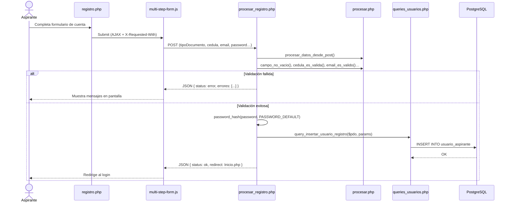
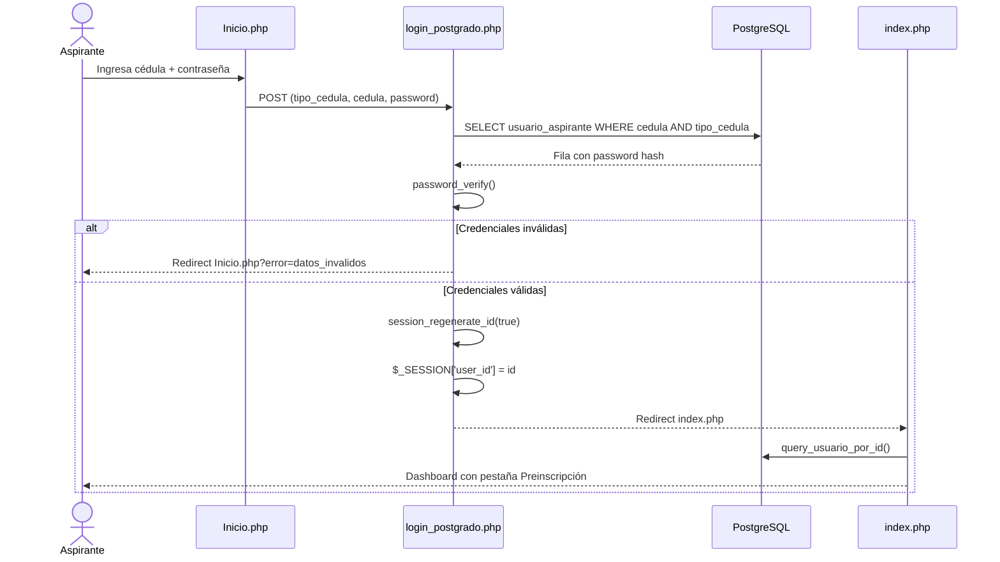
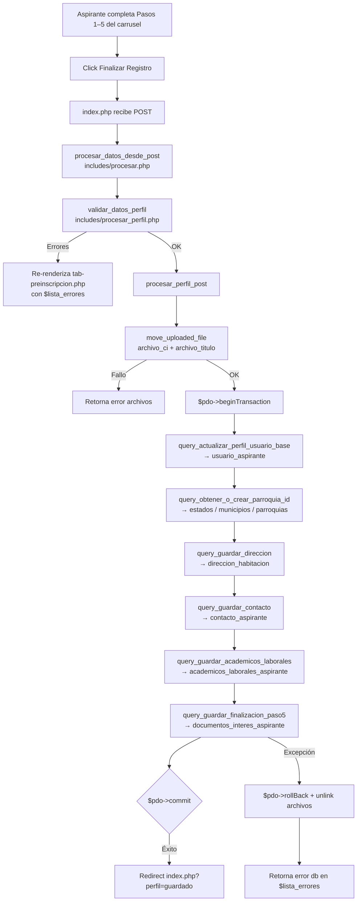
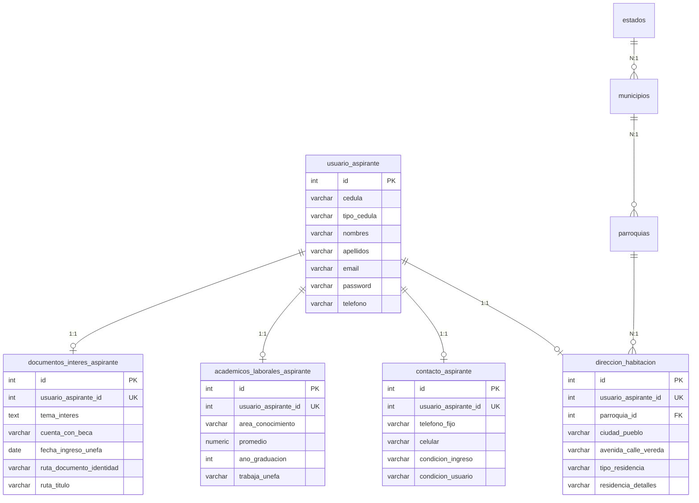
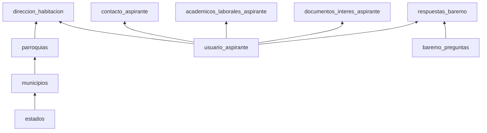
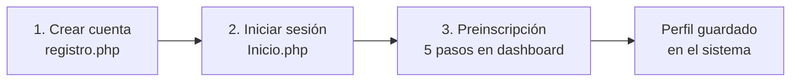

# Manual de Entrega del Sistema — SIP-Postgrado UNEFA

**Versión del documento:** 1.0 — Módulo de Registro y Preinscripción  
**Audiencia:** Decanato de la Universidad y equipo de ingeniería del siguiente módulo  
**Stack técnico:** PHP 5.6+ · PDO · PostgreSQL · Arquitectura MVC ligera por capas  
**Resumen ejecutivo para Decanato:** ver `RESUMEN_EJECUTIVO_DECANO.md` (2–3 páginas, listo para PDF)

---

## Parte I — Visión general del módulo entregado

### 1. Introducción al Módulo Actual

El **Sistema Integral de Postgrado (SIP-Postgrado)**, en su fase actual, implementa el **módulo de registro relacional del aspirante**. Su propósito institucional es permitir que personas que desean ingresar a un programa de maestría de la UNEFA:

1. **Creen una cuenta de acceso** con credenciales verificadas (cédula, correo y contraseña cifrada).
2. **Inicien sesión** de forma segura mediante sesiones PHP regeneradas.
3. **Completen la preinscripción** a través de un formulario multipaso (carrusel de 5 pasos) que recopila datos personales, de habitación, contacto, trayectoria académico-laboral y documentación de respaldo.
4. **Persistan su información de manera normalizada** en PostgreSQL, distribuida en tablas relacionales en lugar de un único campo de texto, lo que habilita consultas, reportes y la integración con módulos futuros (baremo, inscripciones, pagos, expediente).

#### Alcance funcional entregado

| Fase | Descripción | Estado |
|------|-------------|--------|
| **Registro inicial** | Alta de `usuario_aspirante` con hash de contraseña (`password_hash`) | ✅ Operativo |
| **Autenticación** | Login por cédula + tipo de documento + contraseña | ✅ Operativo |
| **Preinscripción (carrusel)** | Formulario de 5 pasos con validación cliente y servidor | ✅ Operativo |
| **Persistencia relacional** | Inserción/actualización atómica en tablas normalizadas (`ON CONFLICT`) | ✅ Operativo |
| **Baremo dinámico** | Lectura de preguntas desde `baremo_preguntas` para el Paso 5 | ✅ Lectura |
| **Guardado de respuestas baremo** | Persistencia de puntajes/respuestas del aspirante | ⏳ Pendiente (siguiente iteración) |
| **Inscripciones / Pagos** | Pestañas de UI preparadas en el dashboard | ⏳ Esqueleto visual |

#### Principios de diseño adoptados

- **Separación de responsabilidades:** las vistas no ejecutan SQL; los controladores validan y orquestan; las consultas encapsulan el acceso a datos.
- **Transaccionalidad:** el guardado final del perfil se ejecuta dentro de `beginTransaction()` / `commit()` / `rollBack()` para garantizar consistencia.
- **Idempotencia de actualización:** todas las inserciones del perfil usan `ON CONFLICT (usuario_aspirante_id) DO UPDATE` de PostgreSQL, permitiendo que el aspirante corrija y reenvíe su preinscripción sin duplicar registros.
- **Compatibilidad PHP 5.6:** sin tipado de retorno en funciones, uso de `array()` y `function_exists()` para evitar redefiniciones al incluir archivos múltiples veces.

---

### 2. Mapa de Arquitectura de Archivos

El proyecto sigue una **arquitectura en capas** con puntos de entrada públicos en la raíz y lógica reutilizable en `includes/` y `queries/`.

```
pagina_postgrado_version 5-2026/
│
├── Inicio.php                    ← Portal público (login)
├── registro.php                  ← Vista pública de registro inicial
├── index.php                     ← Dashboard autenticado (orquestador principal)
│
├── includes/                     ← CAPA DE INFRAESTRUCTURA Y CONTROLADORES
│   ├── config.php                ← Conexión PDO → PostgreSQL ($pdo, $GLOBALS['pdo'])
│   ├── paths_helper.php          ← Rutas relativas (app_url, app_web_base)
│   ├── procesar.php              ← Utilidades y validadores compartidos
│   ├── procesar_registro.php     ← Controlador POST del registro inicial
│   ├── login_postgrado.php       ← Controlador POST del inicio de sesión
│   ├── procesar_perfil.php       ← Controlador de validación y guardado del perfil
│   ├── header.php / sidebar.php  ← Componentes de layout del dashboard
│   ├── tab-datos-personales.php  ← Vista parcial: Paso 1 del carrusel
│   ├── tab-preinscripcion.php    ← Vista parcial: Pasos 2–5 + formulario POST
│   ├── tab-inscripciones.php     ← Vista parcial: módulo futuro
│   └── tab-pagos.php             ← Vista parcial: módulo futuro
│
├── queries/                      ← CAPA DE ACCESO A DATOS (MODELO)
│   ├── queries_usuarios.php      ← CRUD aspirante + tablas del perfil
│   └── queries_baremo.php        ← Consultas del instrumento de entrevista
│
├── assets/
│   ├── css/                      ← Estilos (style.css, style-inicio.css, …)
│   └── js/
│       ├── scripts.js            ← Navegación del carrusel y validación cliente
│       └── multi-step-form.js    ← Envío AJAX del registro público
│
└── uploads/documentos/             ← Almacenamiento de CI y título (JPG/PNG)
```

#### 2.1 Relación jerárquica: Vista → Controlador → Modelo

```
┌─────────────────────────────────────────────────────────────────────────┐
│                        PUNTOS DE ENTRADA (Raíz)                         │
├─────────────────┬───────────────────────┬───────────────────────────────┤
│   Inicio.php    │     registro.php      │          index.php            │
│   (login UI)    │  (registro UI + AJAX) │   (dashboard + POST perfil)   │
└────────┬────────┴───────────┬───────────┴──────────────┬────────────────┘
         │                    │                          │
         ▼                    ▼                          ▼
┌────────────────┐  ┌─────────────────────┐  ┌──────────────────────────┐
│login_postgrado │  │ procesar_registro   │  │   procesar_perfil.php    │
│    .php        │  │      .php           │  │  validar_datos_perfil()  │
│ (controlador)  │  │  (controlador)      │  │  procesar_perfil_post()  │
└────────┬───────┘  └──────────┬──────────┘  └────────────┬─────────────┘
         │                       │                          │
         └───────────────────────┴──────────────────────────┘
                                 │
                    ┌────────────┴────────────┐
                    ▼                         ▼
           ┌──────────────┐        ┌───────────────────┐
           │  procesar.php │        │ queries_usuarios  │
           │  (validadores)│        │ queries_baremo    │
           └──────────────┘        └─────────┬─────────┘
                                             ▼
                                    ┌─────────────────┐
                                    │   PostgreSQL    │
                                    │   (postgrado)   │
                                    └─────────────────┘
```

#### 2.2 Descripción de archivos en `includes/`

| Archivo | Rol | Dependencias clave |
|---------|-----|-------------------|
| `config.php` | Establece la conexión PDO a PostgreSQL (`host`, `port`, `dbname`) y expone `$pdo` vía `$GLOBALS['pdo']`. | — |
| `paths_helper.php` | Genera URLs correctas independientemente de la subcarpeta de Laragon (`app_url()`). | — |
| `procesar.php` | **Capa transversal de validación:** `procesar_datos_desde_post()`, `campo_no_vacio()`, `cedula_es_valida()`, `telefono_ve_valido()`, etc. | — |
| `procesar_registro.php` | Controlador del **registro inicial**. Valida campos, hashea contraseña y llama a `query_insertar_usuario_registro()`. Responde JSON si la petición es AJAX. | `config`, `procesar`, `queries_usuarios` |
| `login_postgrado.php` | Controlador de **autenticación**. Verifica credenciales con `password_verify()`, regenera sesión y redirige al dashboard. | `config`, `paths_helper` |
| `procesar_perfil.php` | **Núcleo del módulo de preinscripción.** Contiene `validar_datos_perfil()`, funciones de mapeo camelCase→snake_case y `procesar_perfil_post()` con transacción PDO. | `procesar`, `config`, `queries_usuarios` |
| `tab-datos-personales.php` | Fragmento HTML/PHP del **Paso 1** (identidad). Incluido dentro de `tab-preinscripcion.php`. | Variables `$datos_form`, `$estudiante` |
| `tab-preinscripcion.php` | **Vista del carrusel completo** (Pasos 1–5). Define el `<form method="POST">`, renderiza preguntas del baremo desde `$preguntas_por_categoria` y gestiona la UI de carga de archivos. | `tab-datos-personales.php`, `queries_baremo` (vía `index.php`) |
| `header.php` / `sidebar.php` | Componentes de navegación del dashboard autenticado. | `paths_helper` |

#### 2.3 Descripción de archivos en `queries/`

| Archivo | Función | Tabla(s) PostgreSQL |
|---------|---------|---------------------|
| `queries_usuarios.php` | Capa de persistencia del aspirante y su perfil normalizado. | Ver tabla 2.4 |
| `queries_baremo.php` | Lectura del catálogo de preguntas para la entrevista. | `baremo_preguntas` |

#### 2.4 Inventario de funciones en `queries_usuarios.php`

| Función | Operación | Tabla destino |
|---------|-----------|---------------|
| `query_usuario_por_id()` | SELECT | `usuario_aspirante` |
| `query_insertar_usuario_registro()` | INSERT | `usuario_aspirante` |
| `query_actualizar_perfil_usuario_base()` | UPDATE | `usuario_aspirante` |
| `query_obtener_o_crear_parroquia_id()` | SELECT/INSERT en cascada | `estados` → `municipios` → `parroquias` |
| `query_guardar_direccion()` | UPSERT (`ON CONFLICT`) | `direccion_habitacion` |
| `query_guardar_contacto()` | UPSERT | `contacto_aspirante` |
| `query_guardar_academicos_laborales()` | UPSERT | `academicos_laborales_aspirante` |
| `query_guardar_finalizacion_paso5()` | UPSERT | `documentos_interes_aspirante` |

#### 2.5 Correspondencia carrusel ↔ archivos ↔ tablas

| Paso del carrusel | Vista (HTML) | Controlador (mapeo) | Función query | Tabla |
|-------------------|--------------|---------------------|---------------|-------|
| **1 — Datos personales** | `tab-datos-personales.php` | `procesar_perfil_post()` → identidad base | `query_actualizar_perfil_usuario_base()` | `usuario_aspirante` |
| **2 — Dirección** | `tab-preinscripcion.php` (#paso-2) | Mapeo `ciudadHabitacion`, `avenidaCalle`, etc. | `query_guardar_direccion()` | `direccion_habitacion` |
| **3 — Contacto** | `tab-preinscripcion.php` (#paso-3) | Mapeo `telefono`, `celular`, `condicion`, redes | `query_guardar_contacto()` | `contacto_aspirante` |
| **4 — Académico / Laboral** | `tab-preinscripcion.php` (#paso-4) | Mapeo `areaConocimiento`, `promedio`, `cargo`, etc. | `query_guardar_academicos_laborales()` | `academicos_laborales_aspirante` |
| **5 — Entrevista / Docs** | `tab-preinscripcion.php` (#paso-5) | Mapeo `temaInvestigacion`, archivos adjuntos | `query_guardar_finalizacion_paso5()` | `documentos_interes_aspirante` |

> **Convención de nombres:** el formulario HTML usa **camelCase** (`temaInvestigacion`, `parroquiaHabitacion`). El controlador traduce a **snake_case** (`tema_interes`, `parroquia_id`) antes de invocar las funciones en `queries/`.

---

### 3. Diagrama de Flujo de Datos

El recorrido completo de la información del aspirante se divide en **tres macro-flujos**: registro, autenticación y preinscripción.

#### 3.1 Flujo de Registro Inicial (aspirante nuevo)



#### 3.2 Flujo de Autenticación



#### 3.3 Flujo de Preinscripción (carrusel → PostgreSQL)

Este es el **flujo central del módulo entregado**. Todos los pasos del carrusel se envían en un único `POST` al presionar **Finalizar Registro** en el Paso 5.



#### 3.4 Detalle del mapeo de datos (formulario → base de datos)

```
$_POST (camelCase)                    procesar_perfil_post()              queries/ (snake_case)              PostgreSQL
─────────────────────────────────────────────────────────────────────────────────────────────────────────────────────
primerNombre, segundoNombre      →    nombres                      →    query_actualizar_perfil_usuario_base  →  usuario_aspirante.nombres
primerApellido, segundoApellido  →    apellidos                    →                                       →  usuario_aspirante.apellidos
celular                          →    telefono (solo dígitos)      →                                       →  usuario_aspirante.telefono

estadoHabitacion,                →    query_obtener_o_crear_       →    parroquia_id                        →  direccion_habitacion.parroquia_id
municipioHabitacion,                  parroquia_id()
parroquiaHabitacion
ciudadHabitacion                 →    ciudad_pueblo                →    query_guardar_direccion             →  direccion_habitacion.ciudad_pueblo
avenidaCalle                     →    avenida_calle_vereda         →                                       →  direccion_habitacion.avenida_calle_vereda
urbanizacionBarrio               →    urbanizacion_barrio_sector   →                                       →  direccion_habitacion.urbanizacion_barrio_sector
tipoResidencia                   →    tipo_residencia              →                                       →  direccion_habitacion.tipo_residencia
residencia, piso, apartamento    →    residencia_detalles          →                                       →  direccion_habitacion.residencia_detalles

twitter, facebook, instagram,    →    redes + teléfonos +          →    query_guardar_contacto              →  contacto_aspirante.*
linkedin                         →    condiciones
telefono, celular
condicion, condicionUsuario

areaConocimiento, nivelAcademico →    campos académicos y           →    query_guardar_academicos_laborales  →  academicos_laborales_aspirante.*
universidad, tituloAcademico,         laborales
anoGraduacion, promedio,
tipoInstitucion, nombreInstitucion,
antiguedad, telefonoTrabajo,
cargo, trabajaUnefa

temaInvestigacion                →    tema_interes                 →    query_guardar_finalizacion_paso5    →  documentos_interes_aspirante.*
tipoBeca                         →    cuenta_con_beca              →                                       →
fechaIngresoUnefa                →    fecha_ingreso_unefa          →                                       →
archivo_ci, archivo_titulo       →    rutas en uploads/documentos/ →    ruta_documento_identidad, ruta_titulo
```

#### 3.5 Modelo relacional impactado



#### 3.6 Validación en dos capas

| Capa | Ubicación | Responsabilidad |
|------|-----------|-----------------|
| **Cliente** | `assets/js/scripts.js` | Impide avanzar de paso sin campos obligatorios (`irPaso()`). Valida el formulario completo antes del `submit`. |
| **Servidor** | `procesar_perfil.php` → `validar_datos_perfil()` | Reglas de negocio definitivas: formato de cédula/teléfono, campos obligatorios, archivos adjuntos (`$_FILES`). |

> La validación del servidor es la **fuente de verdad**. La validación JavaScript mejora la experiencia de usuario pero no sustituye al backend.

---

## Parte II — Configuración del entorno, esquema de base de datos y guía de despliegue

### 4. Requisitos del entorno de ejecución

#### 4.1 Software necesario

| Componente | Versión mínima recomendada | Uso en el proyecto |
|------------|---------------------------|-------------------|
| **PHP** | 5.6+ (desarrollo actual: 8.1 en Laragon) | Motor del backend, sesiones, PDO |
| **PostgreSQL** | 12+ | Base de datos relacional `postgrado` |
| **Apache / Nginx** | Cualquier versión estable | Servidor web (Laragon incluye Apache) |
| **Extensión PHP `pdo_pgsql`** | Obligatoria | Conexión a PostgreSQL |
| **Extensión PHP `mbstring`** | Recomendada | Validación de contraseñas y cadenas UTF-8 |
| **Navegador moderno** | Chrome, Firefox, Edge | Formulario multipaso y dashboard |

#### 4.2 Estructura de despliegue local (Laragon)

El proyecto está diseñado para ejecutarse como sitio virtual bajo Laragon en Windows:

```
C:\laragon\www\pagina_postgrado_version 5-2026\
```

**URL de acceso típica:**

```
http://localhost/pagina_postgrado_version%205-2026/Inicio.php
```

> Laragon detecta automáticamente la subcarpeta del proyecto. La función `app_url()` en `includes/paths_helper.php` calcula la ruta base para que los enlaces funcionen sin hardcodear el nombre de la carpeta.

#### 4.3 Puntos de entrada públicos

| URL relativa | Archivo | Acción |
|--------------|---------|--------|
| `Inicio.php` | Portal de login | Formulario → `includes/login_postgrado.php` |
| `registro.php` | Registro de aspirante | Formulario → `includes/procesar_registro.php` (AJAX) |
| `index.php` | Dashboard autenticado | Requiere `$_SESSION['user_id']` |

---

### 5. Configuración de la aplicación

#### 5.1 Conexión a PostgreSQL (`includes/config.php`)

El archivo central de configuración establece la conexión PDO y la expone globalmente para los controladores:

```php
$host     = "localhost";
$port     = "5433";        // Puerto personalizado de PostgreSQL en Laragon
$dbname   = "postgrado";
$user     = "postgres";
$password = "<CONTRASEÑA>"; // ⚠ No versionar credenciales reales en producción

$pdo = new PDO("pgsql:host=$host;port=$port;dbname=$dbname", $user, $password, [
    PDO::ATTR_ERRMODE            => PDO::ERRMODE_EXCEPTION,
    PDO::ATTR_DEFAULT_FETCH_MODE => PDO::FETCH_ASSOC,
    PDO::ATTR_EMULATE_PREPARES   => false,
]);
$GLOBALS['pdo'] = $pdo;
```

**Opciones PDO configuradas:**

| Atributo | Valor | Motivo |
|----------|-------|--------|
| `ERRMODE_EXCEPTION` | `EXCEPTION` | Los errores SQL lanzan excepciones capturables en `try/catch` |
| `FETCH_ASSOC` | Arreglos asociativos | Consistencia en todo el código |
| `EMULATE_PREPARES` | `false` | Consultas preparadas nativas de PostgreSQL (mayor seguridad) |

#### 5.2 Checklist de configuración inicial

1. **Crear la base de datos** en PostgreSQL:
   ```sql
   CREATE DATABASE postgrado
       WITH ENCODING 'UTF8'
       LC_COLLATE = 'Spanish_Venezuela.1252'
       LC_CTYPE = 'Spanish_Venezuela.1252';
   ```

2. **Importar o crear el esquema** de tablas (ver sección 6). Las tablas del módulo de aspirantes deben existir antes de ejecutar el sistema.

3. **Editar `includes/config.php`** con host, puerto, usuario y contraseña del entorno destino.

4. **Crear y dar permisos a la carpeta de uploads:**
   ```text
   uploads/documentos/   ← escritura para el usuario del servidor web (IIS_IUSRS / www-data)
   ```
   El sistema crea la carpeta automáticamente con `mkdir(..., 0777)` si no existe, pero en producción se recomienda `0755` con propietario correcto.

5. **Verificar extensión PDO PostgreSQL:**
   ```bash
   php -m | findstr pdo_pgsql
   ```

6. **Poblar catálogos mínimos:**
   - Tabla `baremo_preguntas` (14 preguntas en 3 categorías en el entorno de desarrollo actual).
   - Tablas geográficas `estados`, `municipios`, `parroquias` (opcional: el sistema puede crear registros al vuelo vía `query_obtener_o_crear_parroquia_id()`).

#### 5.3 Seguridad — recomendaciones para producción

| Riesgo actual | Mitigación recomendada para el siguiente módulo |
|---------------|------------------------------------------------|
| Credenciales en texto plano en `config.php` | Migrar a variables de entorno (`.env`) fuera del webroot |
| Carpeta `uploads/` accesible por URL | Validar MIME en servidor; considerar `.htaccess` que bloquee ejecución de scripts |
| Contraseñas | Ya se usa `password_hash()` / `password_verify()` con `PASSWORD_BCRYPT` |
| Sesiones | `session_regenerate_id(true)` implementado en login |
| SQL Injection | Todas las queries usan PDO preparado con parámetros nombrados |

---

### 6. Esquema de base de datos PostgreSQL

**Base de datos:** `postgrado`  
**Esquema:** `public`  
**Motor:** PostgreSQL con soporte `ON CONFLICT` (UPSERT)

#### 6.1 Diagrama de dependencias entre tablas



#### 6.2 Tabla maestra: `usuario_aspirante`

Almacena la cuenta de acceso del aspirante. Es la entidad raíz de todo el módulo.

| Columna | Tipo | Nulo | Descripción |
|---------|------|------|-------------|
| `id` | `integer` | NO | PK, autoincremental (`usuarios_id_seq`) |
| `tipo_cedula` | `varchar(8)` | NO | `V` o `E` (CHECK constraint) |
| `cedula` | `integer` | SÍ | Solo dígitos, sin prefijo |
| `nombres` | `varchar(100)` | NO | Primer y segundo nombre concatenados |
| `apellidos` | `varchar(100)` | NO | Primer y segundo apellido concatenados |
| `email` | `varchar(150)` | NO | Único (`uq_email`) |
| `password` | `varchar(255)` | NO | Hash bcrypt |
| `telefono` | `varchar(20)` | SÍ | Celular principal (se actualiza en preinscripción) |
| `direccion` | `text` | SÍ | Legacy; valor inicial `'Pendiente'` al registrar |
| `fecha_registro` | `timestamp` | SÍ | Default `CURRENT_TIMESTAMP` |

**Índices y restricciones:**
- PK: `usuarios_pkey` (`id`)
- UNIQUE: `uq_email` (`email`)
- CHECK: `tipo_cedula IN ('V', 'E')`
- Referenciada en cascada por todas las tablas del perfil (`ON DELETE CASCADE`)

#### 6.3 Tablas geográficas (normalización de dirección)

| Tabla | Columnas clave | Relación |
|-------|---------------|----------|
| `estados` | `id`, `nombre` | Raíz geográfica |
| `municipios` | `id`, `estado_id` FK, `nombre` | Pertenece a un estado |
| `parroquias` | `id`, `municipio_id` FK, `nombre` | Pertenece a un municipio |

> La función `query_obtener_o_crear_parroquia_id()` resuelve el `parroquia_id` a partir de los campos del formulario `estadoHabitacion`, `municipioHabitacion` y `parroquiaHabitacion`. Si las tablas geográficas están vacías, crea los registros necesarios en el momento del guardado.

#### 6.4 Tabla: `direccion_habitacion` (Paso 2 del carrusel)

Relación **1:1** con `usuario_aspirante` (`usuario_aspirante_id` UNIQUE).

| Columna | Tipo | Nulo | Origen en formulario |
|---------|------|------|---------------------|
| `usuario_aspirante_id` | `integer` | NO | Sesión (`$_SESSION['user_id']`) |
| `parroquia_id` | `integer` | NO | FK → `parroquias.id` |
| `ciudad_pueblo` | `varchar(150)` | NO | `ciudadHabitacion` |
| `avenida_calle_vereda` | `varchar(255)` | NO | `avenidaCalle` |
| `urbanizacion_barrio_sector` | `varchar(255)` | SÍ | `urbanizacionBarrio` |
| `tipo_residencia` | `varchar(50)` | NO | `tipoResidencia` |
| `residencia_detalles` | `varchar(150)` | NO | `residencia`, `piso`, `apartamento` |

**UPSERT:** `ON CONFLICT (usuario_aspirante_id) DO UPDATE SET ...`

#### 6.5 Tabla: `contacto_aspirante` (Paso 3)

| Columna | Tipo | Nulo | Origen en formulario |
|---------|------|------|---------------------|
| `telefono_fijo` | `varchar(11)` | NO | `telefono` (11 dígitos, inicia con 0) |
| `celular` | `varchar(11)` | NO | `celular` |
| `condicion_ingreso` | `varchar(100)` | NO | `condicion` |
| `condicion_usuario` | `varchar(100)` | NO | `condicionUsuario` |
| `twitter` / `facebook` / `instagram` / `linkedin` | `varchar(100)` | SÍ | Redes sociales (opcionales) |

#### 6.6 Tabla: `academicos_laborales_aspirante` (Paso 4)

| Columna | Tipo | Nulo | Origen en formulario |
|---------|------|------|---------------------|
| `area_conocimiento` | `varchar(150)` | NO | `areaConocimiento` |
| `nivel_academico` | `varchar(100)` | NO | `nivelAcademico` |
| `universidad` | `varchar(200)` | NO | `universidad` |
| `titulo_obtenido` | `varchar(200)` | NO | `tituloAcademico` |
| `ano_graduacion` | `integer` | NO | `anoGraduacion` (texto convertido a entero) |
| `promedio` | `numeric(4,2)` | NO | `promedio` |
| `tipo_institucion` | `varchar(100)` | NO | `tipoInstitucion` |
| `nombre_institucion` | `varchar(200)` | NO | `nombreInstitucion` |
| `antiguedad` | `varchar(100)` | NO | `antiguedad` |
| `telefono_trabajo` | `varchar(11)` | SÍ | `telefonoTrabajo` |
| `cargo` | `varchar(150)` | NO | `cargo` |
| `trabaja_unefa` | `varchar(2)` | NO | `trabajaUnefa` (`Sí` / `No`) |

#### 6.7 Tabla: `documentos_interes_aspirante` (Paso 5)

| Columna | Tipo | Nulo | Origen en formulario |
|---------|------|------|---------------------|
| `tema_interes` | `text` | NO | `temaInvestigacion` |
| `cuenta_con_beca` | `varchar(50)` | NO | `tipoBeca` (default `'No'` si vacío) |
| `fecha_ingreso_unefa` | `date` | NO | `fechaIngresoUnefa` (default fecha actual si vacío) |
| `ruta_documento_identidad` | `varchar(255)` | NO | `uploads/documentos/ci_{id}_{timestamp}.ext` |
| `ruta_titulo` | `varchar(255)` | NO | `uploads/documentos/titulo_{id}_{timestamp}.ext` |

**Formatos de archivo aceptados:** JPG y PNG (validados en cliente; reforzar en servidor en iteración futura).

#### 6.8 Tablas del baremo (lectura operativa / escritura pendiente)

**`baremo_preguntas`** — Catálogo de preguntas para la entrevista:

| Columna | Tipo | Descripción |
|---------|------|-------------|
| `id` | `integer` | PK |
| `pregunta` | `text` | Enunciado mostrado en la tabla del Paso 5 |
| `categoria` | `varchar(50)` | Agrupador (`Academico`, `Investigacion`, `Otros`) |
| `orden` | `integer` | Orden de visualización |

**Estado actual del catálogo:** 14 preguntas distribuidas en 3 categorías.

**`respuestas_baremo`** — Respuestas del aspirante (tabla preparada, **sin función de guardado implementada aún**):

| Columna | Tipo | Descripción |
|---------|------|-------------|
| `id_aspirante` | `integer` | FK → `usuario_aspirante.id` |
| `id_pregunta` | `integer` | FK → `baremo_preguntas.id` |
| `respuesta` | `varchar(2)` | Valor del radio: `si` / `no` |
| `fecha_respuesta` | `timestamp` | Default `CURRENT_TIMESTAMP` |

> Los inputs del formulario se generan dinámicamente con nombres `baremo_{id}` (ver `baremo_nombre_input()` en `tab-preinscripcion.php`). El equipo del siguiente módulo debe implementar `query_guardar_respuestas_baremo()` en `queries_baremo.php` e invocarla dentro de la transacción de `procesar_perfil_post()`.

#### 6.9 Inventario completo de tablas

| Tabla | Registros típicos | Módulo |
|-------|-------------------|--------|
| `usuario_aspirante` | 1 por aspirante | Registro + perfil base |
| `estados` / `municipios` / `parroquias` | Catálogo geográfico | Dirección |
| `direccion_habitacion` | 1 por aspirante | Preinscripción Paso 2 |
| `contacto_aspirante` | 1 por aspirante | Preinscripción Paso 3 |
| `academicos_laborales_aspirante` | 1 por aspirante | Preinscripción Paso 4 |
| `documentos_interes_aspirante` | 1 por aspirante | Preinscripción Paso 5 |
| `baremo_preguntas` | Catálogo institucional | Entrevista |
| `respuestas_baremo` | N × preguntas por aspirante | Entrevista (pendiente) |
| `users` | — | Tabla legacy, no usada por este módulo |

---

### 7. Guía de despliegue paso a paso

#### 7.1 Despliegue en Laragon (desarrollo / demostración)

```mermaid
flowchart LR
    A[Clonar/copiar proyecto a www/] --> B[Configurar config.php]
    B --> C[Crear BD postgrado en pgAdmin]
    C --> D[Ejecutar scripts SQL del esquema]
    D --> E[Insertar preguntas baremo]
    E --> F[Iniciar Apache + PostgreSQL en Laragon]
    F --> G[Abrir Inicio.php en navegador]
    G --> H[Registrar aspirante de prueba]
    H --> I[Login → completar preinscripción]
```



**Pasos detallados:**

1. Copiar la carpeta del proyecto a `C:\laragon\www\`.
2. Abrir **Laragon** → iniciar **Apache** y **PostgreSQL**.
3. En **pgAdmin** o `psql`, crear la base `postgrado` e importar el esquema.
4. Editar `includes/config.php` (puerto PostgreSQL en Laragon suele ser `5432` o `5433` según instalación).
5. Navegar a `Inicio.php`, registrar un aspirante y completar el carrusel de preinscripción.
6. Verificar en pgAdmin que las 5 tablas del perfil contienen datos para el `usuario_aspirante_id` correspondiente.

#### 7.2 Despliegue en servidor institucional (producción)

| Paso | Acción |
|------|--------|
| 1 | Subir archivos al servidor vía FTP/SFTP o repositorio Git |
| 2 | Configurar Virtual Host apuntando al directorio del proyecto |
| 3 | Asegurar PHP ≥ 5.6 con `pdo_pgsql` habilitado |
| 4 | Crear base de datos PostgreSQL dedicada con usuario de permisos mínimos (solo `postgrado`) |
| 5 | Mover credenciales fuera del webroot o usar variables de entorno |
| 6 | Configurar permisos: `uploads/documentos/` escribible por el daemon web |
| 7 | Habilitar HTTPS (certificado SSL institucional) |
| 8 | Configurar `error_log` de PHP para no exponer errores al usuario final |
| 9 | Realizar prueba de humo: registro → login → preinscripción → verificación en BD |

#### 7.3 Verificación post-despliegue (checklist QA)

| # | Prueba | Resultado esperado |
|---|--------|-------------------|
| 1 | Acceder a `Inicio.php` sin sesión | Muestra formulario de login |
| 2 | Acceder a `index.php` sin sesión | Redirige a `Inicio.php` |
| 3 | Registrar nuevo aspirante | JSON `{ status: "ok" }` o redirect a login |
| 4 | Login con credenciales válidas | Redirect a `index.php` con nombre en header |
| 5 | Enviar preinscripción incompleta | Lista de errores en pantalla, sin cambios en BD |
| 6 | Enviar preinscripción completa con archivos | Redirect `?perfil=guardado`, datos en 5 tablas |
| 7 | Reenviar preinscripción del mismo usuario | UPSERT actualiza registros sin duplicar |
| 8 | Tabla baremo vacía | Mensaje informativo en Paso 5, resto del flujo funcional |

---

### 8. Solución de problemas frecuentes

| Síntoma | Causa probable | Solución |
|---------|---------------|----------|
| *"El sistema de la universidad no está disponible"* al cargar cualquier página | PostgreSQL detenido o credenciales incorrectas en `config.php` | Verificar servicio PG, puerto y contraseña |
| Formulario de registro no responde | `multi-step-form.js` no cargado o error JS | Verificar consola del navegador; confirmar ruta `assets/js/multi-step-form.js` |
| Preinscripción valida en pantalla pero no guarda | `rollBack()` por error SQL en transacción | Revisar `error_log` de PHP; verificar mapeo de campos y restricciones NOT NULL |
| Error FK en `parroquia_id` | Tabla `parroquias` vacía y fallo en `query_obtener_o_crear_parroquia_id` | Verificar permisos INSERT en tablas geográficas |
| Archivos no se guardan | Permisos de `uploads/documentos/` | `chmod 755` o equivalente Windows; verificar propietario del proceso web |
| Preguntas de baremo no aparecen | Tabla `baremo_preguntas` vacía | Insertar catálogo de preguntas |
| Cédula duplicada al registrar | UNIQUE en email o cédula existente | `procesar_registro.php` captura código `23505` y muestra mensaje específico |

**Ubicación de logs:**
- PHP: configuración `error_log` del `php.ini` de Laragon (`C:\laragon\bin\php\php-{version}\php.ini`)
- Apache: `C:\laragon\logs\`

---

### 9. Entrega al equipo del siguiente módulo

#### 9.1 Estado del código entregado

```
Módulo Registro + Preinscripción
├── [✅] Registro de cuenta (usuario_aspirante)
├── [✅] Autenticación con sesión segura
├── [✅] Carrusel 5 pasos con validación dual (JS + PHP)
├── [✅] Persistencia relacional con transacción PDO
├── [✅] UPSERT en todas las tablas del perfil
├── [✅] Carga de documentos (CI + título)
├── [✅] Lectura dinámica del baremo
├── [⏳] Guardado de respuestas baremo → respuestas_baremo
├── [⏳] Módulo inscripciones (UI esqueleto en tab-inscripciones.php)
└── [⏳] Módulo pagos (UI esqueleto en tab-pagos.php)
```

#### 9.2 Tareas sugeridas para la siguiente iteración

1. **Implementar `query_guardar_respuestas_baremo($pdo, $usuario_id, $datos)`** en `queries_baremo.php`:
   - Iterar campos `baremo_*` del `$_POST`.
   - INSERT con `ON CONFLICT` o DELETE + INSERT dentro de la transacción existente.

2. **Agregar `<select name="parroquiaHabitacion">`** al Paso 2 de `tab-preinscripcion.php`:
   - Cargar parroquias vía AJAX desde un endpoint que consulte `parroquias` filtrado por municipio.
   - Eliminar dependencia de creación automática de registros geográficos.

3. **Validación server-side de archivos:**
   - Verificar `mime_content_type()` o `finfo` además de la extensión.
   - Limitar tamaño máximo (`upload_max_filesize` en `php.ini`).

4. **Módulos inscripciones y pagos:**
   - Crear `queries_inscripciones.php` y `queries_pagos.php` siguiendo el patrón de `queries_usuarios.php`.
   - Crear controladores `procesar_inscripcion.php` / `procesar_pago.php` en `includes/`.

#### 9.3 Convenciones que debe mantener el equipo

| Convención | Detalle |
|------------|---------|
| Nombres de campos HTML | camelCase (`primerNombre`, `temaInvestigacion`) |
| Parámetros a queries | snake_case (`titulo_obtenido`, `tema_interes`) |
| Protección de funciones | `if (!function_exists('nombre_funcion'))` en todos los archivos |
| Acceso a BD | Solo desde `queries/`, nunca desde vistas |
| Compatibilidad PHP | Sin tipado de retorno; usar `array()` en lugar de `[]` si se requiere PHP 5.6 estricto |
| PostgreSQL | Usar `ON CONFLICT (usuario_aspirante_id) DO UPDATE` para relaciones 1:1 |

#### 9.4 Archivos clave para iniciar el desarrollo

| Prioridad | Archivo | Por qué |
|-----------|---------|---------|
| 🔴 Alta | `includes/procesar_perfil.php` | Punto de extensión de la transacción |
| 🔴 Alta | `queries/queries_baremo.php` | Agregar persistencia de respuestas |
| 🟡 Media | `includes/tab-preinscripcion.php` | Vista del carrusel a modificar |
| 🟡 Media | `includes/config.php` | Configuración de entorno |
| 🟢 Baja | `assets/js/scripts.js` | Validación cliente del carrusel |

---

## Parte III — Manual de usuario institucional y glosario de términos

### 10. Manual de usuario para el aspirante

Esta sección está dirigida a las personas que desean ingresar a un programa de postgrado de la UNEFA y deben completar su registro y preinscripción en línea.

#### 10.1 ¿Quién debe usar este módulo?

El formulario de **Pre-Inscripción / Baremo** está pensado para **aspirantes que no son estudiantes regulares** de la universidad. Si usted ya cursa materias de postgrado como estudiante activo, los pasos de inscripción y pago se gestionarán en módulos posteriores del SIP-Postgrado.

#### 10.2 Requisitos previos

Antes de comenzar, tenga a mano:

- Cédula de identidad vigente (física o digital en imagen).
- Título universitario de pregrado (imagen JPG o PNG).
- Correo electrónico personal activo.
- Datos de contacto, dirección de habitación y trayectoria laboral actualizados.
- Conexión estable a Internet y un navegador actualizado (Chrome, Firefox o Edge).

#### 10.3 Proceso completo en tres etapas



---

#### 10.4 Etapa 1 — Creación de cuenta (`registro.php`)

1. Desde la página de inicio, haga clic en **Registro**.
2. Complete el formulario de registro inicial con:
   - Tipo de documento (V o E).
   - Número de cédula (7 u 8 dígitos).
   - Nombres y apellidos.
   - Correo electrónico.
   - Contraseña (mínimo 8 caracteres, al menos una mayúscula).
   - Confirmación de contraseña.
3. Pulse el botón de envío. El sistema validará los datos y creará su cuenta.
4. Si el correo o la cédula ya están registrados, verá un mensaje de error específico.
5. Al finalizar correctamente, será redirigido a la pantalla de **Inicio de Sesión**.

> **Importante:** La contraseña queda cifrada en el servidor. No es posible recuperarla por este medio; conserve sus credenciales en un lugar seguro.

---

#### 10.5 Etapa 2 — Inicio de sesión (`Inicio.php`)

1. Seleccione su **tipo de documento** (V, E o P según corresponda).
2. Ingrese su **número de cédula** (solo dígitos).
3. Escriba su **contraseña**.
4. Pulse **INGRESAR**.

Si las credenciales son correctas, accederá al **Dashboard del aspirante** (`index.php`), donde verá su nombre en la barra superior y las pestañas de navegación del sistema.

---

#### 10.6 Etapa 3 — Preinscripción (carrusel de 5 pasos)

En el dashboard, seleccione la pestaña **Pre-Inscripción / Baremo**. El formulario se presenta como un carrusel secuencial. Los campos marcados con asterisco rojo (<span style="color:#b91c1c">*</span>) son **obligatorios**.

##### Paso 1 — Datos personales

| Campo | Obligatorio | Indicación |
|-------|:-----------:|------------|
| Tipo de documento | Sí | V (venezolano) o E (extranjero) |
| Cédula de identidad | Sí | 7 u 8 dígitos numéricos |
| Primer nombre | Sí | Tal como aparece en el documento |
| Segundo nombre | No | Opcional |
| Primer apellido | Sí | — |
| Segundo apellido | Sí | — |
| Fecha de nacimiento | Sí | Formato calendario |
| Sexo | Sí | Femenino / Masculino |
| Estado civil | Sí | Seleccionar de la lista |

Pulse **Siguiente →** para avanzar. El sistema no permitirá continuar si faltan campos obligatorios.

##### Paso 2 — Dirección de habitación

| Campo | Obligatorio | Indicación |
|-------|:-----------:|------------|
| Estado | Sí | Estado de la República donde reside |
| Municipio | Sí | Municipio de habitación |
| Ciudad / Pueblo | Sí | Texto libre |
| Avenida / Calle / Vereda | Sí | Dirección detallada |
| Urbanización / Barrio / Sector | No | Opcional |
| Tipo de residencia | Sí | Casa, Apartamento, Quinta u Otro |
| Residencia (casa o edificio) | No | Nombre o número de vivienda |

##### Paso 3 — Redes sociales y contacto

| Campo | Obligatorio | Indicación |
|-------|:-----------:|------------|
| Twitter, Facebook, Instagram, LinkedIn | No | Usuario o perfil (opcional) |
| Teléfono fijo | Sí | 11 dígitos, debe iniciar con **0** (ej. `02121234567`) |
| Celular | Sí | 11 dígitos, debe iniciar con **0** (ej. `04141234567`) |
| Condición de ingreso | Sí | Nuevo ingreso, Reingreso, Equivalencia o Traslado |
| Condición del usuario | Sí | Civil, Militar activo, Militar retirado o Funcionario público |

##### Paso 4 — Datos académicos y laborales

**Datos académicos:**

| Campo | Obligatorio |
|-------|:-----------:|
| Área de conocimiento | Sí |
| Nivel académico | Sí |
| Universidad de egreso | Sí |
| Título obtenido | Sí |
| Año de graduación | Sí |
| Promedio de calificaciones | Sí (0 a 20, admite decimales) |

**Datos laborales:**

| Campo | Obligatorio |
|-------|:-----------:|
| Tipo de institución | Sí |
| Nombre de la institución u organismo | Sí |
| Antigüedad | Sí |
| Teléfono de trabajo | No |
| Cargo | Sí |
| ¿Trabaja en la UNEFA? | Sí (Sí / No) |

##### Paso 5 — Entrevista, documentos y cierre

1. **Tabla de baremo:** responda **Sí** o **No** a cada aspecto evaluable según su perfil. Las preguntas se cargan desde el catálogo institucional.
2. **Tema de investigación:** describa su tema de interés vinculado a las áreas prioritarias de desarrollo de la nación (campo obligatorio).
3. **Otros datos:** indique si cuenta con beca y, si aplica, su fecha de ingreso a la UNEFA.
4. **Documentos adjuntos** (obligatorios):
   - **Documento de Identidad** — solo JPG o PNG, imagen a color, clara y legible.
   - **Título universitario** — mismas condiciones.
5. Pulse **Finalizar Registro**.

Si todo es correcto, el sistema guardará su información y mostrará la confirmación. Si hay errores, se listarán en un recuadro rojo al inicio del formulario para que pueda corregirlos sin perder los datos ya ingresados.

---

#### 10.7 Mensajes que puede ver el aspirante

| Mensaje / situación | Significado | Qué hacer |
|---------------------|-------------|-----------|
| Lista roja de errores al enviar | Validación fallida en uno o más campos | Corregir los campos indicados y reenviar |
| `?perfil=guardado` en la URL | Preinscripción guardada con éxito | Ninguna acción adicional por ahora |
| Redirección a `Inicio.php` | Sesión expirada o no autenticado | Volver a iniciar sesión |
| *"El sistema de la universidad no está disponible"* | Problema de servidor o base de datos | Reintentar más tarde o contactar soporte |
| *"Esta cédula ya pertenece a un usuario registrado"* | Cuenta existente | Usar Inicio de Sesión en lugar de registrarse de nuevo |

---

### 11. Manual para el Decanato y personal administrativo

#### 11.1 Rol del módulo en el proceso de admisión

El SIP-Postgrado, en su versión actual, cubre la **fase de captación y preinscripción digital** del aspirante. Su función institucional es:

1. **Digitalizar** el registro de datos que antes se recopilaban en formularios físicos.
2. **Normalizar** la información en una base de datos relacional consultable para comités de admisión.
3. **Centralizar** documentos digitalizados (cédula y título) asociados a cada aspirante.
4. **Preparar** el instrumento de baremo para la fase de entrevista (lectura operativa; puntaje automatizado en desarrollo).

#### 11.2 Qué puede consultar el Decanato hoy

Desde **pgAdmin** o cualquier cliente SQL conectado a la base `postgrado`, el personal autorizado puede ejecutar consultas como:

**Listado de aspirantes registrados:**

```sql
SELECT id, tipo_cedula, cedula, nombres, apellidos, email, fecha_registro
FROM usuario_aspirante
ORDER BY fecha_registro DESC;
```

**Aspirantes con preinscripción completa (tienen dirección registrada):**

```sql
SELECT u.id, u.nombres, u.apellidos, u.email,
       d.ciudad_pueblo, a.promedio, doc.tema_interes
FROM usuario_aspirante u
INNER JOIN direccion_habitacion d ON d.usuario_aspirante_id = u.id
INNER JOIN academicos_laborales_aspirante a ON a.usuario_aspirante_id = u.id
INNER JOIN documentos_interes_aspirante doc ON doc.usuario_aspirante_id = u.id
ORDER BY u.fecha_registro DESC;
```

**Documentos digitalizados de un aspirante:**

```sql
SELECT u.nombres, u.apellidos,
       doc.ruta_documento_identidad,
       doc.ruta_titulo
FROM documentos_interes_aspirante doc
JOIN usuario_aspirante u ON u.id = doc.usuario_aspirante_id
WHERE u.id = :id_aspirante;
```

Los archivos físicos se almacenan en la carpeta `uploads/documentos/` del servidor, con nombres únicos por usuario y marca de tiempo.

#### 11.3 Pestañas del dashboard — estado funcional

| Pestaña | Estado actual | Descripción para el Decanato |
|---------|---------------|------------------------------|
| **Inicio** | Operativa | Resumen académico de demostración |
| **Mi Expediente** | Visual | Consulta de historial (datos de ejemplo) |
| **Inscripciones** | En desarrollo | Selección de materias — próximo módulo |
| **Pagos** | En desarrollo | Gestión de pagos — próximo módulo |
| **Documentos** | Visual | Repositorio documental — próximo módulo |
| **Pre-Inscripción / Baremo** | **Operativa** | Formulario principal de este entregable |

#### 11.4 Indicadores sugeridos para reportes institucionales

| Indicador | Consulta base |
|-----------|--------------|
| Total de aspirantes registrados | `COUNT(*)` en `usuario_aspirante` |
| Preinscripciones completadas | `COUNT(*)` en `direccion_habitacion` |
| Promedio general del cohorte | `AVG(promedio)` en `academicos_laborales_aspirante` |
| Aspirantes con beca | `COUNT(*)` donde `cuenta_con_beca != 'No'` en `documentos_interes_aspirante` |
| Aspirantes que trabajan en UNEFA | `COUNT(*)` donde `trabaja_unefa = 'Sí'` |

#### 11.5 Responsabilidades institucionales recomendadas

| Rol | Responsabilidad |
|-----|----------------|
| **Decanato** | Aprobar catálogo de preguntas del baremo y políticas de admisión |
| **Coordinación de Postgrado** | Mantener actualizado el catálogo en `baremo_preguntas` |
| **Soporte técnico / TI** | Operar servidor, respaldos de BD y carpeta `uploads/` |
| **Comité de admisión** | Consultar datos normalizados para evaluación y entrevistas |

---

### 12. Preguntas frecuentes (FAQ)

#### Para aspirantes

**¿Puedo modificar mi preinscripción después de enviarla?**  
Sí. Si vuelve a ingresar al sistema, completa el formulario y lo envía nuevamente, el sistema **actualiza** sus datos sin crear un registro duplicado.

**¿Qué formato deben tener las imágenes de mis documentos?**  
Solo **JPG** o **PNG**. Deben ser fotografías a color, claras y legibles. Se recomienda resolución de 1400 × 1400 píxeles.

**¿Por qué no me deja avanzar al siguiente paso?**  
Debe completar todos los campos obligatorios (marcados con *) del paso actual. El sistema mostrará un aviso indicando qué falta.

**¿Necesito completar las redes sociales?**  
No. Twitter, Facebook, Instagram y LinkedIn son opcionales.

**Olvidé mi contraseña. ¿Cómo la recupero?**  
La recuperación automática de contraseña no está implementada en esta versión. Debe contactar a la coordinación de postgrado o soporte técnico institucional.

#### Para personal administrativo

**¿Dónde se guardan los documentos escaneados?**  
En `uploads/documentos/` del servidor web. Las rutas relativas quedan registradas en `documentos_interes_aspirante.ruta_documento_identidad` y `ruta_titulo`.

**¿Las respuestas del baremo se guardan automáticamente?**  
No en esta versión. La tabla `respuestas_baremo` existe en la base de datos, pero la persistencia de respuestas está programada para el siguiente módulo.

**¿Cómo agrego o modifico preguntas del baremo?**  
Insertando o actualizando registros en la tabla `baremo_preguntas` con las columnas `pregunta`, `categoria` y `orden`. Los cambios se reflejan automáticamente en el Paso 5 del formulario.

**¿Cómo respaldo la información?**  
Ejecutando `pg_dump` sobre la base `postgrado` y copiando la carpeta `uploads/documentos/` de forma periódica.

```bash
pg_dump -h localhost -p 5433 -U postgres -d postgrado -F c -f respaldo_postgrado.dump
```

---

### 13. Glosario de términos

| Término | Definición |
|---------|-----------|
| **SIP-Postgrado** | Sistema Integral de Postgrado de la UNEFA. Plataforma web para la gestión académica de programas de maestría y especialización. |
| **Aspirante** | Persona que solicita ingreso a un programa de postgrado y que aún no ha sido admitida formalmente como estudiante. |
| **Preinscripción** | Proceso de llenado del formulario multipaso que recopila datos personales, de contacto, trayectoria y documentos del aspirante. |
| **Registro** | Creación de la cuenta de acceso (cédula, correo y contraseña) en `usuario_aspirante`. Es el primer paso antes de la preinscripción. |
| **Carrusel / Stepper** | Interfaz de formulario dividida en 5 pasos secuenciales con navegación Atrás / Siguiente. |
| **Baremo** | Instrumento de evaluación con preguntas de Sí/No que permiten al comité de admisión conocer el perfil del aspirante en áreas académicas, de investigación y otros aspectos. |
| **Pregunta de baremo** | Ítem evaluable almacenado en `baremo_preguntas`, agrupado por categoría (`Academico`, `Investigacion`, `Otros`). |
| **Dashboard** | Panel principal del aspirante autenticado (`index.php`), con pestañas de navegación a los distintos módulos. |
| **UPSERT** | Operación de base de datos que inserta un registro nuevo o lo actualiza si ya existe (`ON CONFLICT DO UPDATE` en PostgreSQL). |
| **Transacción** | Conjunto de operaciones de base de datos que se ejecutan de forma atómica: todas tienen éxito o ninguna se aplica (`commit` / `rollBack`). |
| **PDO** | PHP Data Objects. Capa de abstracción que permite ejecutar consultas parametrizadas de forma segura contra PostgreSQL. |
| **Sesión (`$_SESSION`)** | Mecanismo que identifica al usuario autenticado entre peticiones. La clave `user_id` vincula al aspirante con sus datos. |
| **Normalización** | Organización de los datos en tablas relacionales especializadas (dirección, contacto, académicos, documentos) en lugar de un único bloque de texto. |
| **Parroquia** | División político-territorial venezolana. En el sistema se almacena como `parroquia_id` con referencia a la tabla `parroquias`. |
| **Condición de ingreso** | Clasificación del aspirante según su situación académica previa: nuevo ingreso, reingreso, equivalencia o traslado. |
| **Condición del usuario** | Clasificación institucional: civil, militar activo, militar retirado o funcionario público. |
| **Tema de interés investigativo** | Descripción libre del área de investigación que el aspirante desea desarrollar en el programa de postgrado. |
| **Cohorte** | Grupo de aspirantes o estudiantes que inician un programa en el mismo período académico. |
| **Expediente** | Conjunto documental y académico del estudiante o aspirante a lo largo de su trayectoria en la universidad. |
| **Controlador** | Archivo PHP en `includes/` que recibe datos del formulario, valida y coordina el guardado (ej. `procesar_perfil.php`). |
| **Query / Consulta** | Función en `queries/` que encapsula una operación SQL (ej. `query_guardar_direccion()`). |
| **Vista** | Archivo PHP/HTML que renderiza la interfaz al usuario (ej. `tab-preinscripcion.php`). No accede directamente a la base de datos. |
| **Laragon** | Entorno de desarrollo local (Windows) que integra Apache, PHP y PostgreSQL para pruebas del sistema. |
| **pg_dump** | Utilidad de PostgreSQL para generar respaldos de la base de datos. |

---

### 14. Control del documento

| Campo | Valor |
|-------|-------|
| **Título** | Manual de Entrega — SIP-Postgrado UNEFA |
| **Versión** | 1.0 |
| **Fecha** | Junio 2026 |
| **Módulo cubierto** | Registro relacional y preinscripción del aspirante |
| **Elaborado por** | Equipo de desarrollo SIP-Postgrado |
| **Destinatarios** | Decanato UNEFA · Equipo de ingeniería del siguiente módulo |
| **Próxima revisión** | Al completar módulos de baremo (escritura), inscripciones y pagos |

---

*Fin del Manual de Entrega — Versión 1.0*
